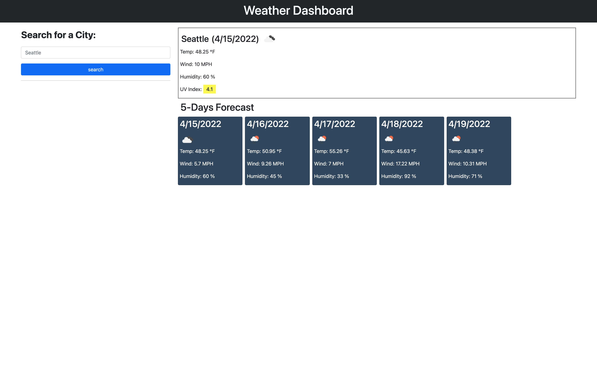

# Weather-Dashboard

This is an weather application that enable the user to put in the name of the city and get weather data of that particular city. This applicatio also enable user to save the search history in the local storage and displays upto to 8 search histories.

# Languages

- CSS
- HTML
- JavaScript
- jQuery
- Bootstrap

# Links

- To deploy application: https://bongomin256.github.io/Weather-Dashboard/
- To the application's repo: https://github.com/bongomin256/Weather-Dashboard

# License

- MIT

# Screenshots of the application

